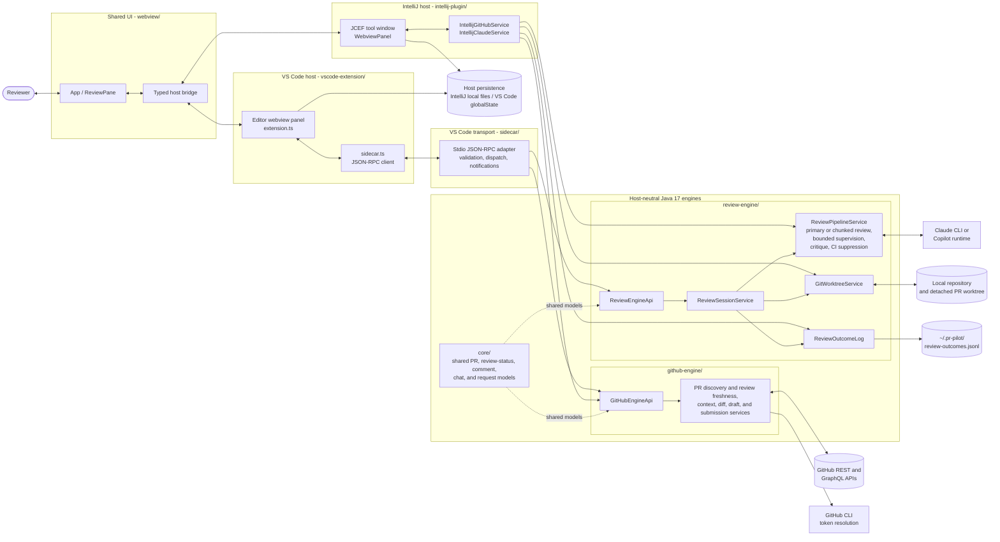

# PR Pilot Architecture

## Boundary rules

- `core`, `github-engine`, and `review-engine` own host-neutral behavior.
- IntelliJ consumes GitHub capabilities through `GitHubEngineApi` and calls review-engine services
  in-process. VS Code reaches both capability surfaces only through the sidecar.
- The shared webview owns the user workflow and communicates through the typed host bridge.
- GitHub credentials remain inside `github-engine`; hosts receive only token-free results.
- Provider processes, worktrees, prompts, parsing, supervision, and review semantics remain inside
  `review-engine`.
- Engine capabilities are declared once and exposed to every host; hosts may not reimplement them.
