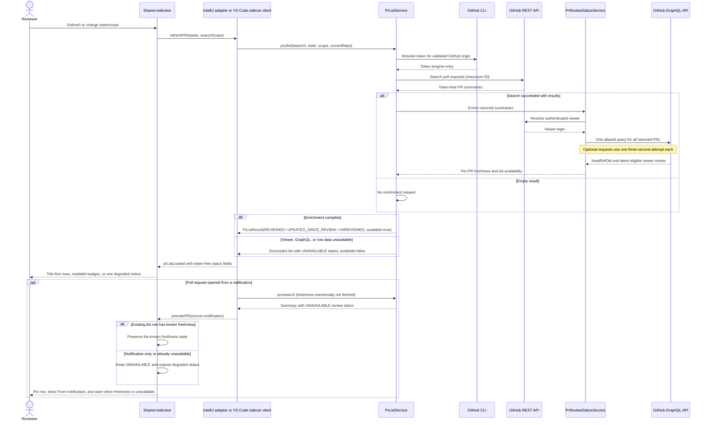

# PR Discovery and Review Freshness

```mermaid
sequenceDiagram
    actor Reviewer
    participant UI as Shared webview
    participant Host as IntelliJ adapter or VS Code sidecar client
    participant Engine as PrListService
    participant CLI as GitHub CLI
    participant REST as GitHub REST API
    participant Freshness as PrReviewStatusService
    participant GraphQL as GitHub GraphQL API

    Reviewer->>UI: Refresh or change state/scope
    UI->>Host: refreshPRs(state, searchScope)
    Host->>Engine: prs/list(baseUrl, state, scope, currentRepo)
    Engine->>CLI: Resolve token for validated GitHub origin
    CLI-->>Engine: Token (engine-only)
    Engine->>REST: Search pull requests (maximum 50)
    REST-->>Engine: Token-free PR summaries

    alt Search succeeded with results
        Engine->>Freshness: Enrich returned summaries
        Freshness->>REST: Resolve authenticated viewer
        REST-->>Freshness: Viewer login
        Freshness->>GraphQL: One aliased query for all returned PRs
        Note over Freshness,GraphQL: Optional requests use one three-second attempt each
        GraphQL-->>Freshness: headRefOid and latest eligible viewer review
        Freshness-->>Engine: Per-PR freshness and list availability
    else Empty result
        Engine->>Engine: No enrichment request
    end

    alt Enrichment complete
        Engine-->>Host: PrListResult(REVIEWED / UPDATED_SINCE_REVIEW / UNREVIEWED, available=true)
    else Viewer, GraphQL, or row data unavailable
        Engine-->>Host: Successful list with UNAVAILABLE states, available=false
    end
    Host-->>UI: prListLoaded with token-free status fields
    UI-->>Reviewer: Title-first rows, readable badges, or one degraded notice

    opt Pull request opened from a notification
        Host->>Engine: prs/search (freshness intentionally not fetched)
        Engine-->>Host: Summary with UNAVAILABLE review status
        Host-->>UI: activatePR(source=notification)
        alt Existing list row has known freshness
            UI->>UI: Preserve the known freshness state
        else Notification-only or already unavailable
            UI->>UI: Keep UNAVAILABLE and expose degraded status
        end
        UI-->>Reviewer: Pin row, show From notification, and warn when freshness is unavailable
    end
```
