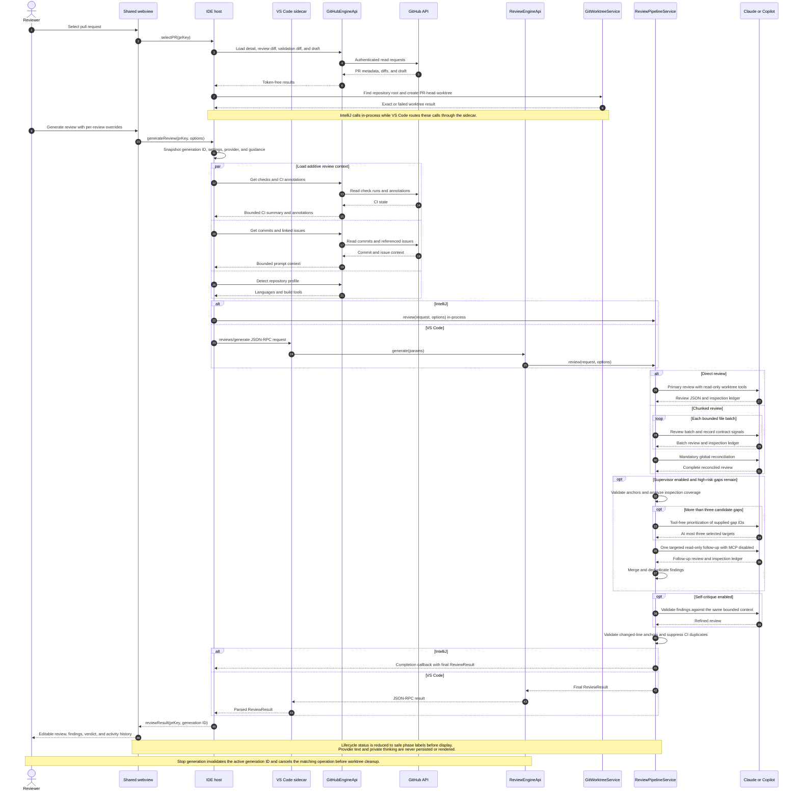

# PR Review Generation Sequence

## Failure behavior

- Missing optional GitHub context omits that prompt section without failing the review.
- Primary provider failure is terminal.
- Supervisor selection, targeted follow-up, and final critique failures keep the best valid review.
- Chunk reconciliation failure returns a visibly marked degraded batch-only result.
- Cancellation and interruption propagate rather than returning a success-shaped fallback.
